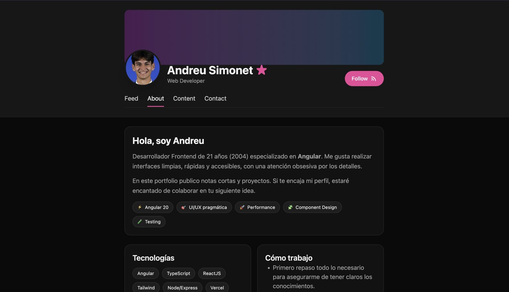

# syco.dev · Portfolio personal

Mi web personal: presentación, proyectos y un **feed de publicaciones** que gestiono desde un panel de administración propio.

**[▶ Ver web](https://syco.dev)**



## Funcionalidades

- 📰 **Feed** de publicaciones, con **RSS** (`/feed.xml`).
- 👤 Secciones **Sobre mí**, **Proyectos** y **Contacto**.
- ✉️ **Formulario de contacto** que envía el mensaje por email.
- 🔐 **Panel de administración** con login sin contraseña: código de un solo uso enviado por email, con caducidad y límite de peticiones.
- ✍️ Publicar y borrar posts desde el panel, protegido con token de sesión.

## Arquitectura

```
Angular 20 (frontend)  ──►  Vercel Functions (/api)  ──►  Redis (Vercel KV / Upstash)
                                    │
                                    └──►  Resend (envío de emails)
```

- **Frontend:** Angular 20 + TypeScript + Tailwind CSS v4.
- **Backend:** funciones serverless en Vercel (Node.js).
- **Datos y sesiones:** Redis, con caducidad (TTL) para códigos y sesiones.
- **Emails:** Resend.

## Seguridad

- Las claves y credenciales van en **variables de entorno**, nunca en el código.
- Códigos de acceso de un solo uso, generados con un generador criptográficamente seguro y con caducidad de 10 minutos.
- Máximo de 5 intentos por código: después se invalida (protección contra fuerza bruta).
- Límite de peticiones por IP en la solicitud de código.
- Tokens de sesión aleatorios generados con `crypto` y válidos 24 h.
- Los errores del servidor no exponen detalles internos al cliente.

## Cómo ejecutarlo en local

```bash
git clone https://github.com/Andreuet23/Portfolio.git
cd Portfolio
npm install
npm start
```

Para las funciones del backend hacen falta estas variables de entorno: `KV_REST_API_URL`, `KV_REST_API_TOKEN`, `RESEND_API_KEY`, `FROM_EMAIL` y `ADMIN_EMAIL`.

---

Hecho por [Andreu Simonet](https://www.linkedin.com/in/andreusimonet).
